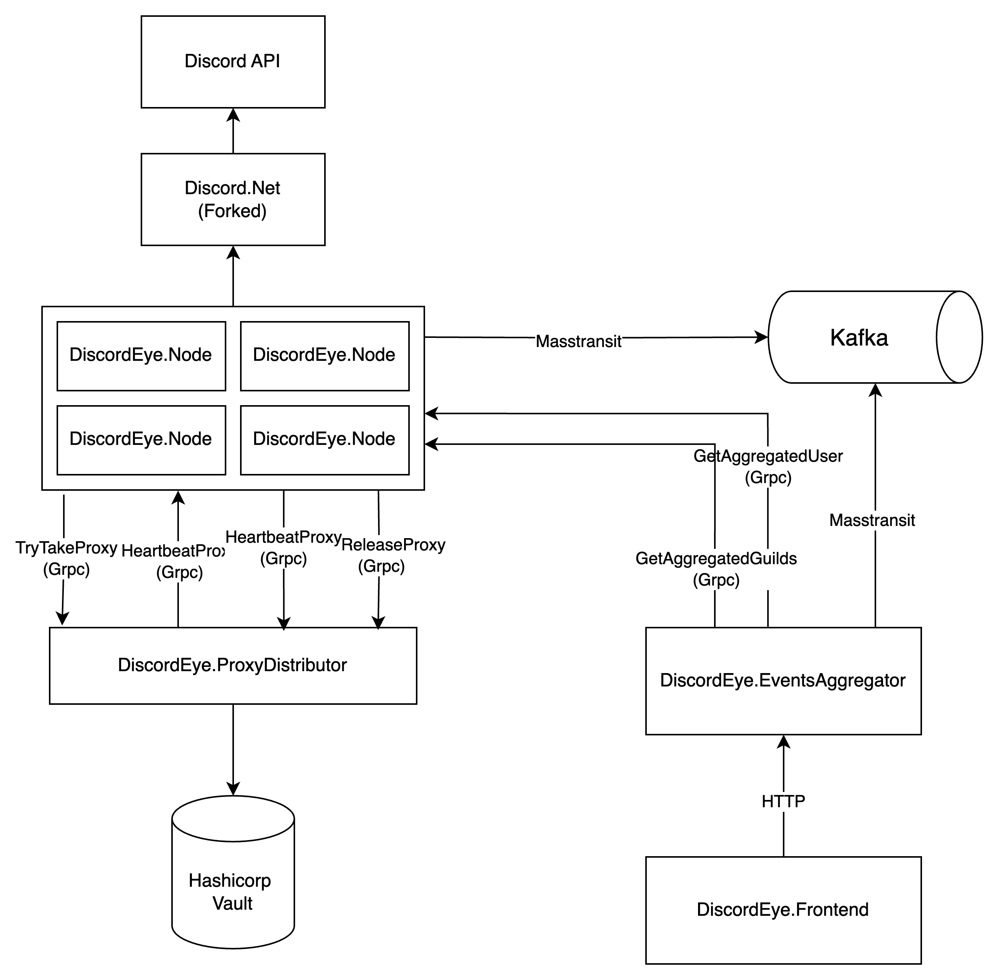

# Architecture Scheme
To refactor or supplement the project schema, we use
[draw.io](https://app.diagrams.net/) and a file called DiscordEye.scheme.drawio,
which is located in the project root folder. After updating you need to save
file in your pull request to keep the schema up to date, and also update the
screenshot in README.md.

# First launch
For the first launch you will need installed packages 
`.NET 8 SDK` & `.NET 8 Runtime`, `Docker Desktop`, (`JetBrains Rider` or Microsoft Visual Studio),
`Postman`. Postman collections with application queries will be included in the repository soon
for ease of code debugging.

Depending on the project you are starting, you may need to complete several
additional actions.

### DiscordEye.Node:
1. Pass your discord account token to `appsettings`. It can be obtained from the header 
`Authorization` in any request in the discord browser client.
2. If you want the node to send events to the Kafka message broker,
you need to run zookeeper & kafka first, this can be done using run
`docker-compose.yml`, which is located in the root folder of the repository. It will still be necessary 
specify the `SendEvents: true` flag in `appsettings` so that the application sends events to the broker.
If you want to use the application without sending events, then set the `SendEvents: false` flag.
3. This application uses a forked Discord.Net library, because in the original version
The library does not have the necessary functionality. For now, the forked library simply lies in a separate repository,
To download and connect, contact the author of the project.

### DiscordEye.ProxyDistributor
1. You need to raise a docker container with Hashicorp Vault and you need to load at least one proxy into the database.

### DiscordEye.EventsAggregator
1. You need to run `zookeper` & `kafka broker` using `docker-compose.yml` in the repository root.
2. For some HTTP requests it will be necessary to run at least one `DiscordEye.Node` node.

### Hashicorp Vault
1. It was decided to use KV storage to store data about proxy servers, as well as
discord tokens for nodes will be stored there.

To enter data into the database, you need to go to `Docker Desktop` -> `vault container` -> `Exec` and enter the commands:
1. To add data `vault kv put secret/proxy/1 address="1.1.1.1" port="1" login="1" password="1"`
2. To view the data `vault kv get secret/proxy/1`
3. To delete data `vault kv delete secret/proxy/1`

### DiscordEye.Frontend
1. Coming soon

# Project Description
### General description
The project was created to make it possible to conveniently track and manipulate the data that produces
users on Discord.

### DiscordEye.ProxyDistributor
This application contains data from proxy servers that it distributes
to nodes in need who have problems with `Cloudflare`. The `ReleaseKey & Heartbeat` mechanism was used,
to maintain consistency and atomicity in proxy usage.

### DiscordEye.Node
This application uses a modified `Discord.Net` library to interact with the `Discord API`.
It listens to events on different servers and sends them to the `Kafka broker`. It was decided to use
multiple instances of nodes because Discord has a limit that a user can be present at the same time
only on 100 servers without purchasing a Nitro subscription. The application can also accept `grpc` requests 
to receive specific information about the user.

### DiscordEye.EventsAggregator
This application aggregates events that were sent by all nodes in the `Kafka broker` and also provides
aggregating queries such as obtaining information about the user from all nodes. Provides `http` handles for
interactions.
